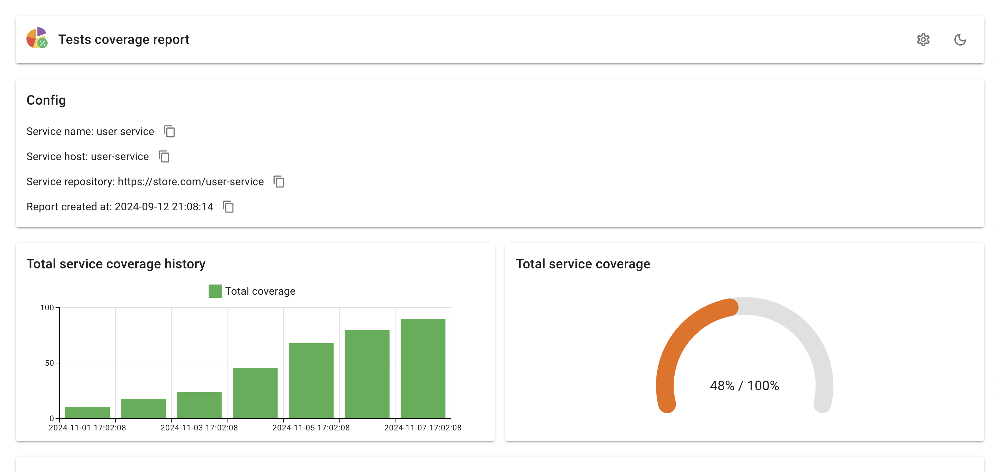
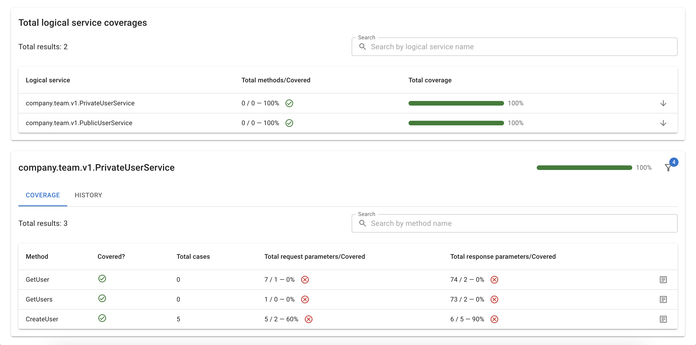
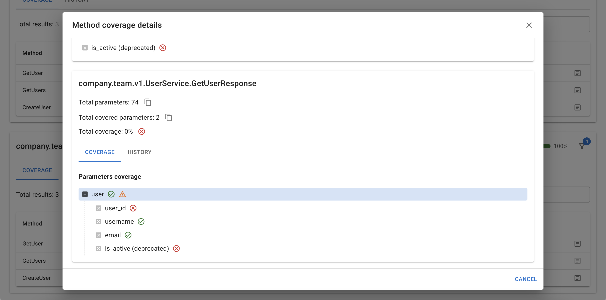

# Tests coverage tool

The Tests Coverage Tool is a comprehensive utility designed to measure code coverage for gRPC services based on their
proto contracts. It provides detailed insights into various aspects of your service's coverage, helping you ensure that
your tests thoroughly validate your gRPC endpoints. The tool gathers the following metrics:

- **Total Coverage Percentage:** The overall coverage percentage across all services;
- **Service-Specific Coverage:** The coverage percentage for each logical service within your gRPC API;
- **Method Coverage:** Whether each gRPC method is covered by tests (covered/not covered);
- **Request/Response Coverage:** Detailed coverage for each method, including the total request parameters, the number
  of covered parameters, and the coverage percentage;
- **Parameter-Level Coverage:** In-depth coverage details for each parameter within the request/response, allowing you
  to see which parts of your API are thoroughly tested;
- **Deprecation Status:** Information on whether methods and their parameters are deprecated, aiding in maintaining
  up-to-date and clean tests;
- **Support for Multiple Services:** The tool can handle coverage reporting for multiple gRPC services within a single
  project;
- **Coverage history:** The tool can maintain the history of overall service coverage, logical service coverage, and
  coverage of gRPC method request and response parameters.

You can see a report example [here](https://nikita-filonov.github.io/tests-coverage-tool/).

If you have any questions, you can ask [@Nikita Filonov](https://t.me/sound_right)

## Preview

### Service coverage



### Logical services coverage



### Method coverage



## Installation

To install the Tests Coverage Tool, use the following command:

````shell
go get github.com/Nikita-Filonov/tests-coverage-tool@latest

````

## Usage

### Client interceptor

Below is an example of how to set up the gRPC client with the coverage interceptor:

```go
package test

import (
	"context"
	"crypto/tls"
	"fmt"
	"log"
	"testing"

	grpcmiddleware "github.com/grpc-ecosystem/go-grpc-middleware"
	"google.golang.org/grpc"
	"google.golang.org/grpc/credentials"

	"github.com/Nikita-Filonov/tests-coverage-tool/tool/coverageinupt"
)

func TestGRPC(t *testing.T) {
	// Set up a gRPC client connection with the coverage interceptor
	conn, err := grpc.Dial(
		"localhost:1000",
		grpc.WithTransportCredentials(credentials.NewTLS(&tls.Config{InsecureSkipVerify: true})),
		grpc.WithUnaryInterceptor(
			grpcmiddleware.ChainUnaryClient(
				// Integrate the CoverageInterceptor to track method coverage
				coverageinupt.CoverageInterceptor(),
			),
		),
	)
	if err != nil {
		log.Fatalf("Failed to connect to gRPC server: %v", err)
	}
	defer conn.Close()

	// Initialize the proto service client
	client := servicev1.NewServiceClient(conn)

	// Call a gRPC method; coverage data will be automatically saved in the specified directory
	resp, err := client.Get(context.Background(), &servicev1.GetRequest{})

	fmt.Println(resp, err)
}

```

### Generate report

Before generating the coverage report, ensure that the `tests-coverage-tool` is installed. This tool relies on server
reflection to gather data, so your gRPC service must support server reflection; otherwise, the tool will be unable to
measure service coverage.

To install the tool, run:

```shell
go install github.com/Nikita-Filonov/tests-coverage-tool/...@latest
```

Once installed, you can generate the coverage report with the following command:

```shell
tests-coverage-tool save-report

```

This will generate a coverage report based on the results gathered during your test runs.

### State

The library includes a built-in function, `report.ReadCoverageReportState`, which simplifies reading the state from a
JSON coverage report. This function serves as a helper for analytics and reporting purposes, allowing users to
efficiently manage the output of a JSON coverage report

Here’s an example of how to use it:

```go
package main

import (
	"fmt"
	"log"

	"github.com/Nikita-Filonov/tests-coverage-tool/tool/report"
)

func main() {
	// Read the coverage report state from the JSON file
	state, err := report.ReadCoverageReportState()
	if err != nil {
		log.Fatalf("Error reading coverage report state: %v\n", err)
	}

	// Perform actions with the coverage state
	fmt.Println(state)
}

```

In this example, the `ReadCoverageReportState` function reads the JSON coverage report, and you can then process the
state variable for further analytics or reporting

## Config

The tool can be configured via environment variables or a YAML configuration file. Below are the available options:

| Environment                            | YAML                  | Default               | Example                                                                                                                                                                                                                                   |
|----------------------------------------|-----------------------|-----------------------|-------------------------------------------------------------------------------------------------------------------------------------------------------------------------------------------------------------------------------------------|
| —                                      | services              | —                     | Defines the gRPC services to monitor. See the example configuration file at [./docs/config-example.yaml](docs/config-example.yaml)                                                                                                        |
| TESTS_COVERAGE_CONFIG_FILE             | —                     | —                     | Path to the YAML configuration file. Example: [./docs/config-example.yaml](docs/config-example.yaml)                                                                                                                                      |
| TESTS_COVERAGE_RESULTS_DIR             | resultsDir            | .                     | Directory where coverage results will be stored. Example: if set to `./tests`, results will be stored in `./tests/coverage-results`                                                                                                       |
| TESTS_COVERAGE_HISTORY_DIR             | historyDir            | .                     | Directory where the history will be saved                                                                                                                                                                                                 |
| TESTS_COVERAGE_HISTORY_FILE            | historyFile           | coverage-history.json | Name of the history file                                                                                                                                                                                                                  |
| TESTS_COVERAGE_HTML_REPORT_DIR         | htmlReportDir         | .                     | Directory where the HTML report will be saved                                                                                                                                                                                             |
| TESTS_COVERAGE_JSON_REPORT_DIR         | jsonReportDir         | .                     | Directory where the JSON report will be saved                                                                                                                                                                                             |
| TESTS_COVERAGE_HTML_REPORT_FILE        | htmlReportFile        | index.html            | Name of the HTML report file                                                                                                                                                                                                              |
| TESTS_COVERAGE_JSON_REPORT_FILE        | jsonReportFile        | coverage-report.json  | Name of the JSON report file                                                                                                                                                                                                              |
| TESTS_COVERAGE_HISTORY_RETENTION_LIMIT | historyRetentionLimit | 30                    | Defines the maximum number of the most recent coverage history records to be retained. In this case, the value `30` means that only the latest 30 entries in the coverage history will be preserved, and older entries will be discarded. |

## History

To save coverage history, you must retain the history file, which is configured using the environment variables
`TESTS_COVERAGE_HISTORY_DIR` and `TESTS_COVERAGE_HISTORY_FILE`. By default, the history file will be stored in the root
directory with the name `coverage-history.json`. You do not need to create this file manually—it will be automatically
generated when you run the save-report command. After that, you simply need to keep the `coverage-history.jso`n file for
subsequent report generations. Each time a new report is generated, the file will be automatically updated with the
latest coverage history, and the history will be added to the coverage report.

If you wish to disable the coverage history functionality, you can set the `TESTS_COVERAGE_HISTORY_DIR` and
`TESTS_COVERAGE_HISTORY_FILE` environment variables to empty strings. This can be done through the YAML configuration
file using the `historyDir` and `historyFile` settings.

## Commands

### Save report

To save a coverage report, use the following command:

```shell
go run ./tests-coverage-tool/main.go save-report
```

This command will generate and save the coverage report based on the collected test data.

### Copy report

To update and merge submodules and then copy the report, run:

```shell
git submodule update --init --recursive
git submodule update --remote --merge

go run ./tests-coverage-tool/main.go copy-report

```

This command is useful for syncing submodules and copying the report to the desired location.

### Print config

To print the current configuration, use the following command:

```shell
go run ./tests-coverage-tool/main.go print-config

```

This command outputs the configuration settings currently in use, allowing you to verify and adjust as needed


